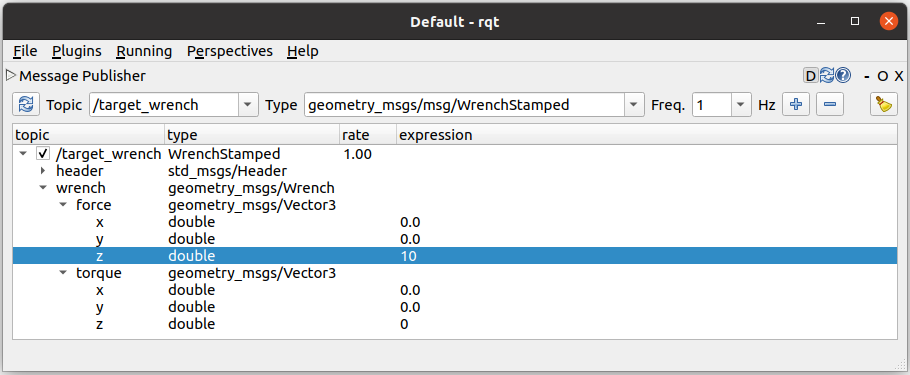

## Cartesian Compliance Controller

This controller implements [Forward Dynamics Compliance Control (FDCC)](https://ieeexplore.ieee.org/document/8206325) for robot manipulators.
The original implementation has been improved and slightly simplified to better support users without a background in robot control.
It still builds on our initial idea of using forward dynamics-based simulations as a core component in *Admittance control*.

It's essentially a hybrid of the `CartesianMotionController` and the
`CartesianForceController`, and offers the interfaces of both controllers for
tracking motion and reference force-torque profiles in parallel.

The behavior can be tweaked by the following parameters:
* The `p` and `d` gains determine the responsiveness in each individual Cartesian axis. The higher these
  values, the faster does the robot *move* in response to the *force-torque* and *motion* inputs.
* The `error_scale` influences the controller's sensitivity uniformly for all axes. It
  post-scales the computed error from the controller gains (by multiplication) and is a little
  easier to adjust with a single parameter. Similar to pure motion and force control, the idea is
  to first weigh the different Cartesian axes with the controller gains and adjust the
  *overall* responsiveness with this parameter.
* The number of internal `iterations` per robot control cycle. The higher this
  value, the more virtual time does the controller have to compute an equilibrium
  between the different inputs before sending the resulting joint commands to
  the robot driver.
* The `stiffness` in each Cartesian dimension. It balances force-torque measurements with
  motion offsets. The higher the values, the higher the restoring forces (and
  torques) when trying to move the robot's end-effector away from the commanded target poses.

Frequent use cases for this controller are following some path with a tool while applying forces in some other direction.
It's also a safe default when working in the transition between contact-less motion and in-contact motion.


## Getting Started
We assume that you have the `cartesian_controller_simulation` package installed.
1) Start the simulation environment as described [here](./../cartesian_controller_simulation/README.md).

2) Now we activate the `cartesian_compliance_controller`:
   ```bash
   ros2 control switch_controllers --start cartesian_compliance_controller
   ```

3) Next, open `rqt` in a new, sourced terminal to publish a target wrench:
   ```bash
   rqt
   ```
   Navigate to `Plugins -> Topics -> Message Publisher` and configure the following window:
   

   Upon checking the checkbox for `/target_wrench`, the robot should move.
   In contrast to the `CartesianForceController`, however, it finds an equilibrium at a specific offset.
   You can experiment a little with different force-torque components.

4) Change some of the controller's parameters:
   In `rqt`, open the *Dynamic Reconfigure* plugin under *Plugins/Configuration* and
   select the *cartesian_compliance_controller*. Experiment a little with the parameters
   (e.g. `solver/error_scale` and the individual `stiffness` values) and observe the end-effector's equilibrium in RViz.

5) You can also steer the robot with an interactive marker.
   Activate the `motion_control_handle`:
   ```bash
   ros2 control switch_controllers --start motion_control_handle
   ```

   This activates an interactive marker for moving the robot's end-effector.
   Drag the marker by its handles. The robot should smoothly follow your lead.
   Note how different values for `stiffness` and `error_scale` influence the behavior.


## Example Configuration
Below is an example `controller_manager.yaml` for a controller specific configuration. Also see [the simulation config](../cartesian_controller_simulation/config/controller_manager.yaml) for further information.
```yaml
controller_manager:
  ros__parameters:
    update_rate: 100  # Hz

    cartesian_compliance_controller:
      type: cartesian_compliance_controller/CartesianComplianceController

    # More controller instances here
    # ...

cartesian_compliance_controller:
  ros__parameters:
    end_effector_link: "tool0"
    robot_base_link: "base_link"
    ft_sensor_ref_link: "sensor_link"
    compliance_ref_link: "tool0"
    joints:
      - joint1
      - joint2
      - joint3
      - joint4
      - joint5
      - joint6

    # Choose: position or velocity.
    command_interfaces:
      - position
        #- velocity

    stiffness:  # w.r.t. compliance_ref_link
        trans_x: 500
        trans_y: 500
        trans_z: 500
        rot_x: 20
        rot_y: 20
        rot_z: 20

    solver:
        error_scale: 0.5
        iterations: 1

    pd_gains:
        trans_x: {p: 0.05, d: 0.005}
        trans_y: {p: 0.05, d: 0.005}
        trans_z: {p: 0.05, d: 0.005}
        rot_x: {p: 1.5}
        rot_y: {p: 1.5}
        rot_z: {p: 1.5}


# More controller specifications here
# ...

```
