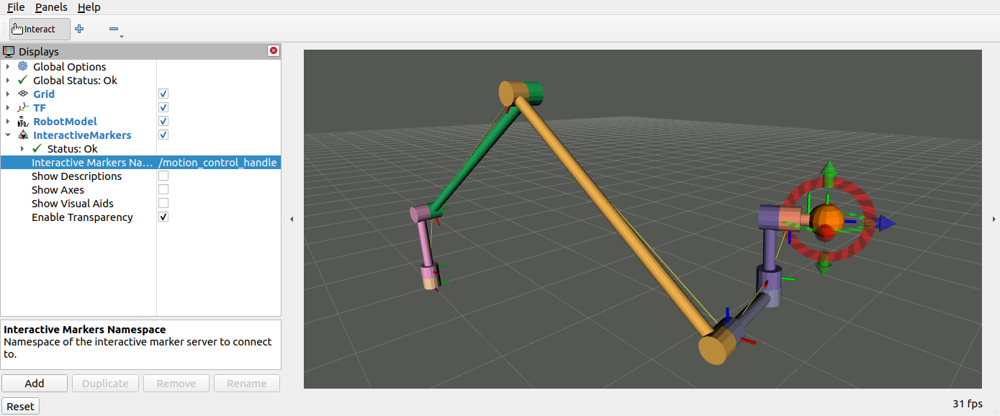

# Cartesian Controller Handles
This package provides graphical click-and-drop handles (interactive markers) for
RViz to be used in conjunction with the `cartesian_motion_controller` and the `cartesian_compliance_controller`.

The markers can be used to control the robot end-effector manually through RViz, which is
especially handy for testing scenarios and Cartesian trajectory teaching.



## Getting started
The controller handles are implemented as ROS2 controllers and are managed by the *controller_manager*.
Here are the typical entries in an example `controller_manager.yaml`:

```yaml
controller_manager:
  ros__parameters:
    update_rate: 100  # Hz

    motion_control_handle:
      type: cartesian_controller_handles/MotionControlHandle

    # More controller instances here
    # ...

motion_control_handle:
  ros__parameters:
    end_effector_link: "tool0"
    robot_base_link: "base_link"
    joints:
      - joint1
      - joint2
      - joint3
      - joint4
      - joint5
      - joint6

# More controller specifications here
# ...
```

When active, the `motion_control_handle` from above will publish a `geometry_msgs/PoseStamped` to the `/target_frame` topic with the coordinates of the interactive marker in RViz.
You can then use this topic to steer controllers of both the `cartesian_motion_controller/CartesianMotionController` and the `cartesian_compliance_controller/CartesianComplianceController` type.
Conventional ROS2 topic remappings will help you setup your preferred configuration with various controllers and handles.

---

**Note**: The motion control handles publish their target frames continuously,
even if you don't touch the interactive marker in RViz. If you want to send
targets to the controllers via scripts (productive use case), make sure to *deactivate* the
`motion_control_handle` through the controller manager so that it does not compete with your script.

---

Also have a look at the `cartesian_controller_simulation` package for an example setup in simulation.

## RViz
You need to create a visualization in RViz to see and interact with the colored handles. Add *InteractiveMarkers* to your *Displays* menu and point it to the right *Update Topic*.
The interactive handle only gets visualized if your `motion control handle` is *active*. If you still see no handles, try toggling the *Interactive Markers*'s checkbox.
