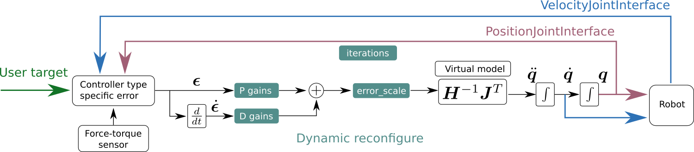

# Solver Details

All controllers rely on fast forward dynamics computations to circumvent the Inverse Kinematics problem.
This dynamics-based solver is the same for all controller types and provides a consistent interface for configuration.

All controllers can handle robot chains with *1* to *n* joints.
Note, however, that using less than *6* joints results in limited Cartesian responsiveness.
For those systems, the controllers will try to get as close to minimizing the
Cartesian error as possible, and as best as the robot kinematics allows for it.

With robot chains containing more than *6* joints, the controllers will move
the additional elbows in an energy optimized manner.

## The Control Loop


The above image depicts the general pipeline of the controllers.
Users set specific targets, depending on their use case and the controller used.
Each controller computes an error with respect to the current state.
Users configure the responsiveness of the controller to that error with a set of gains.
The error_scale is a convenient option to post-multiply the error on all dimensions uniformly.
This is handy for testing parameter ranges with the slider in dynamic reconfigure.
All controllers use the same virtual model to map this Cartesian error to joint motion.

There are two different compile-time interfaces, over which the robots get actuated: `PositionJointInterfaces` and `VelocityJointInterfaces`.

## Configuration
### Controller gains
Forward dynamics turns the search for a feasible mapping of Cartesian input to joint space into a control problem.
The solutions are found iteratively, whereby the system *leaps* forward in virtual time steps to reduce the Cartesian error.
What this error is depends on the controller type used.
For all controllers, a set of six PD gains (one for each Cartesian dimension)
allows to tweak the responsiveness of the system with respect to this error.

Each controller README.md provides a set of meaningful default gains.
Try starting with these values and continuously adapt those to your special use case.

Unfortunately, there won't exist ideal parameters for every use case and robot.
So, for your specific application, you will be tweaking the PD gains at some point.

### Solver parameters
The common solver has three parameters:
* **iterations**: The number of internally simulated cycles per control cycle.
  Increasing this number will give the solver more iterations to approach the given target.
  A value of `10` is a good default for the `CartesianMotionController` and the `CartesianComplianceController`.
  The higher this value, the more does the controller behave like an ideal *inverse kinematics* solver.
  This parameter has no effect for the `CartesianForceController`.

* **error_scale**: An additional multiplicative factor that uniformly scales the
  6-dimensional PD controlled error (both translation and rotation alike).
  Use this parameter to find the right range
  for your PD gains. It's handy to use the slider in dynamic reconfigure for this.

* **publish_state_feedback**: A boolean flag whether to publish the
  controller-internal state. This is helpful for comparing the controllers'
  feedback against the given target reference during parameter tweaking. If
  `true`, each controller will publish its end-effector pose and twist on the local topics `current_pose` and
  `current_twist`, respectively. You can easily find them in a sourced terminal with
  ```bash
  rostopic list | grep current
  ```

All solver parameters can be set online via `dynamic_reconfigure` in the controllers'
`solver` namespace, or at startup via the controller's `.yaml` configuration
file, e.g. with
```yaml
my_cartesian_controller:
    # Type, link and joints specification here
    # ...

    solver:
        error_scale: 0.5
        iterations: 5
        publish_state_feedback: True

    # Further specification
    # ...

```

## Performance
As a default, please build the cartesian_controllers in release mode:

```bash
catkin_make -DCMAKE_BUILD_TYPE=Release
```
If no build type is specified, the controller is automatically built in release mode.

The forward dynamics implementation heavily relies on
orocos_kinematics_dynamics (KDL), which use Eigen for linear algebra.
Building in Release mode can give you a 10-times speed-up, and makes sure that
the implementation of the control loop is not the performance bottle neck.
If you use a higher number of iterations,
then this in fact becomes a requirement.

